# JavaScript Shell

A small POSIX-style shell built in JavaScript as a study project.



## Features

- Interactive REPL with an adaptive prompt
- Colored prompt showing the working directory and the previous command's exit
  status, honoring `NO_COLOR`, `TERM=dumb` and non-TTY output
- Real-time command highlighting: the command word is colored as you type
  (green for builtins, cyan for executables in `PATH`, red otherwise)
- Builtins: `echo`, `cd`, `pwd`, `type`, `exit`, `complete`, `jobs`, `history`, `declare`
- `cd -` and `cd -N` directory-stack navigation (zsh-style)
- External command execution through `PATH`
- Single and double quote parsing
- Backslash escaping
- Standard output and error redirection
- Append redirection
- Tee-style multiwrite redirection: `echo x > a > b` writes to every listed target
- Pipelines
- Background jobs
- Tab completion for commands, files, and registered completion handlers
- Persistent history through `HISTFILE`
- Shell variable declaration and parameter expansion

## Architecture

The shell is intentionally split into small ES modules:

- `app/main.js`: process entrypoint
- `app/shell.js`: readline loop and command orchestration
- `app/parser.js`: command parsing, pipelines, and redirection extraction
- `app/executor.js`: executable lookup, external command execution, and pipelines
- `app/builtins.js`: builtin command behavior
- `app/completion.js`: tab completion logic
- `app/history.js`: in-memory and persistent command history
- `app/jobs.js`: background job tracking
- `app/variables.js`: shell variables and parameter expansion
- `app/io.js`: output and file descriptor helpers
- `app/colors.js`: ANSI color helpers and terminal capability detection
- `app/constants.js`: shared shell constants

See [`docs/ARCHITECTURE.md`](docs/ARCHITECTURE.md) for a detailed walkthrough of
the runtime flows with Mermaid diagrams.

## Development

Requirements:

- Node.js 25

Start the shell:

```sh
./js-shell.sh
```

Run it directly with Node:

```sh
npm run dev
```

## Notes

This repository is a study project. The goal is to keep the implementation
readable and easy to evolve while keeping the shell usable from the command
line.
