# Architecture

Technical reference for the JavaScript shell. It documents the module layout
and the main runtime flows, with Mermaid diagrams rendered natively by GitHub.

The shell is a Node.js REPL: it reads a line, parses it into tokens, expands
shell variables, decides whether the line is a pipeline or a single command,
handles redirection and background execution, runs a builtin or an external
program, then redraws the prompt. Every concern lives in its own module under
`app/`.

---

## 1. Module map

Each module is a factory (`createX`) that returns a small API. `shell.js` is the
composition root: it instantiates every collaborator and wires them together.

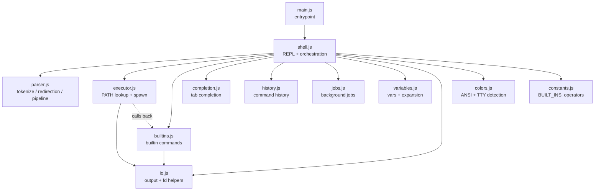

Two wiring details worth noting:

- **`executor` ↔ `builtins` cycle is broken with a late binding.** The executor
  needs to run builtins inside pipelines, but builtins are created *after* the
  executor. `shell.js` passes the executor a closure over a `builtinHandlers`
  variable that is assigned right after, so the reference resolves lazily at
  call time rather than at construction time.
- **`constants.js` is the single source of truth** for the builtin list
  (`BUILT_INS`) and the redirection operators, shared by the parser, executor,
  completion and shell.

---

## 2. Command lifecycle

`handleLine` in `shell.js` is the heart of the REPL. Lines are processed
strictly in order: each `line` event chains onto a `pendingCommand` promise, so
an async command fully completes before the next line runs.

```mermaid
flowchart TD
  A[line event] --> B[trim input]
  B --> C{empty?}
  C -->|yes| P[redraw prompt]
  C -->|no| D[push to history]
  D --> E[parseCommandLine<br/>tokenize]
  E --> F["expandParameters<br/>$VAR and $&#123;VAR&#125;"]
  F --> G{contains a pipe?}

  G -->|yes| H[runPipeline] --> P
  G -->|no| I["extractRedirection<br/>split args from redirect ops"]
  I --> J{"trailing &amp; ?"}
  J -->|yes| K["mark background,<br/>drop the &amp;"]
  J -->|no| L[foreground]
  K --> M
  L --> M{command kind?}

  M -->|type| N[handleType] --> P
  M -->|builtin| O[create redirect files<br/>handleCommand<br/>exit code = 0] --> P
  M -->|external| Q[findExecutable]
  Q --> R{found?}
  R -->|no| S[command not found<br/>exit code = 127] --> P
  R -->|yes| T[create redirect files<br/>runExternalCommand]
  T --> U{background?}
  U -->|yes| V[register job,<br/>print job id] --> P
  U -->|no| W[capture exit code] --> P
```

Key ordering decision: **redirection target files are created only after the
command is known to exist.** A missing external command reports
`command not found` and returns before any `> file` is truncated, matching
shell behavior (a typo never clobbers an output file).

The captured exit code (`0` for builtins, the child's real code for externals,
`127` for not-found) is stored in `lastExitCode` and drives the prompt color.

### As a sequence

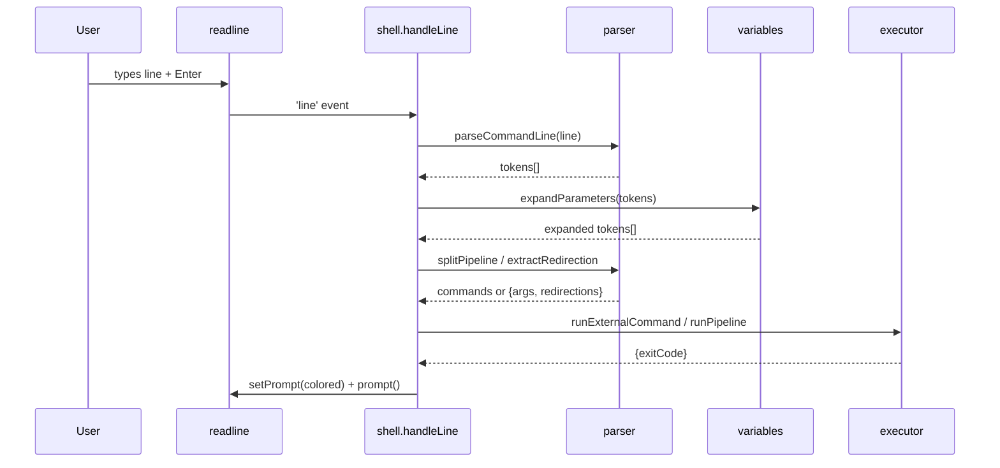

---

## 3. Parsing

`parseCommandLine` is a single-pass character scanner tracking quote state. It
handles backslash escaping, single quotes (literal), double quotes, whitespace
splitting, redirection operators (`>`, `>>`, and the `1`/`2` fd prefixes) and
the pipe symbol.

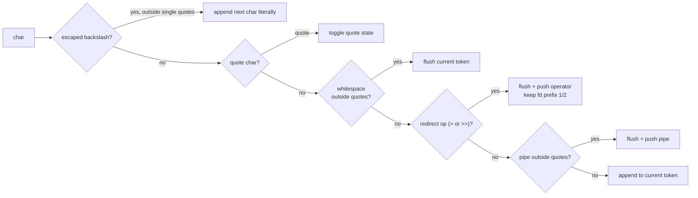

Two derived passes run on the token list:

- **`extractRedirection`** walks the tokens, pulls out `>`/`>>`/`2>`/`2>>`
  operators plus their target filenames, and returns the remaining args along
  with `{stdoutFile, stdoutMode, stderrFile, stderrMode}`.
- **`splitPipeline`** slices the tokens on `|` into an array of command token
  arrays, or returns `null` when there is no pipe.

---

## 4. Pipeline execution

`runPipeline` picks one of two strategies depending on whether any stage is a
builtin.

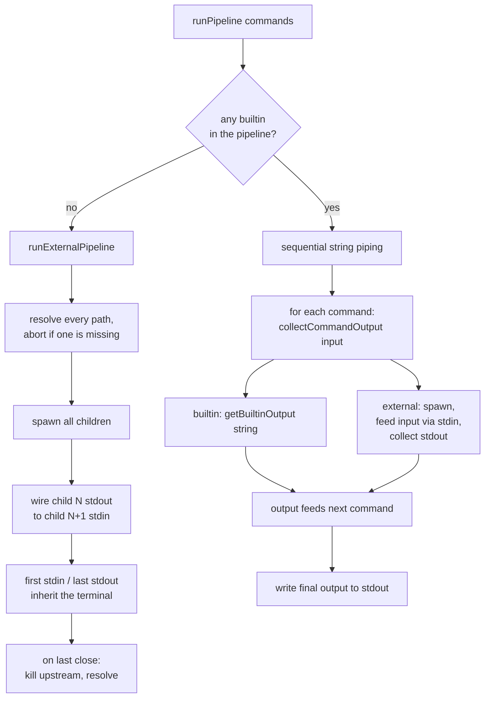

The all-external path uses real OS pipes (`child.stdout.pipe(next.stdin)`) for
streaming. The mixed path can't do that for builtins — they produce strings, not
file descriptors — so it degrades to buffering each stage's stdout as a string
and feeding it to the next stage's stdin.

---

## 5. Tab completion

`completeCommand` is the readline `completer`. What it completes depends on the
cursor position within the line.

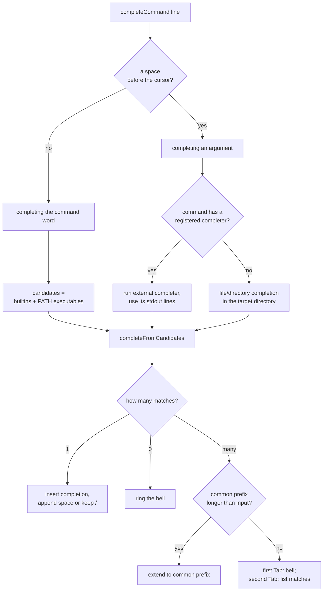

The double-Tab behavior is stateful: `previousCompletionPrefix` and
`previousCompletionHadMultipleMatches` remember the last attempt so the second
consecutive Tab on an ambiguous prefix prints the candidate list. This state is
reset at the start of every `handleLine`.

Registered completers follow the Bash `complete -C` convention: an external
program is invoked with `COMP_LINE`/`COMP_POINT` in the environment and the
command/word/previous-word as argv, and its stdout lines become the candidates.

---

## 6. Prompt and live highlighting

The prompt is rebuilt on every redraw and adapts to color support.

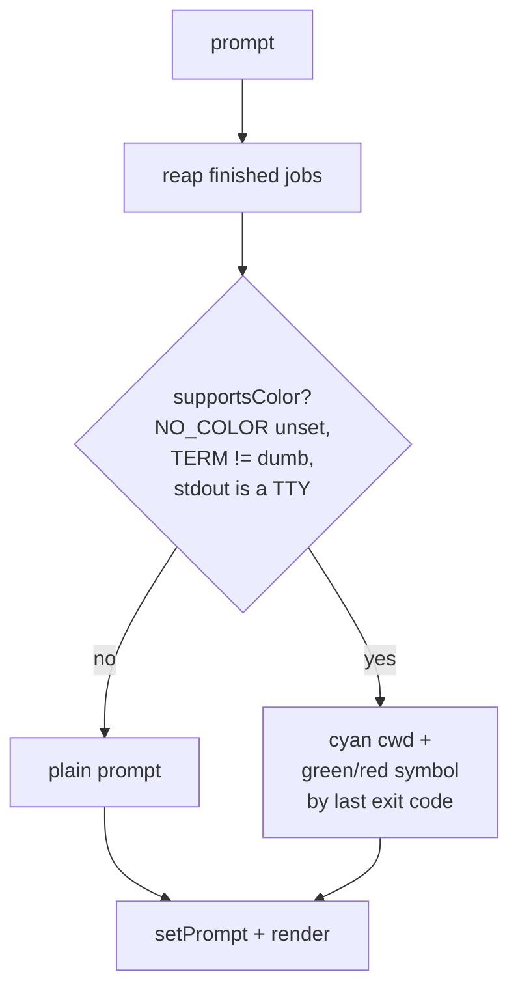

On a color-capable TTY, a `keypress` listener recolors the input line as you
type. It only touches the **command word** (the first token):

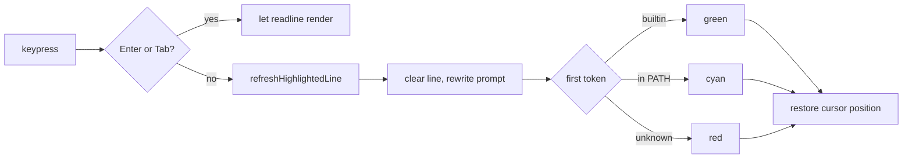

The cursor is repositioned using `stripAnsi` to measure the prompt's *visible*
width (color codes have zero width). Enter and Tab are skipped so readline keeps
ownership of submission and completion rendering; the line recolors on the next
keystroke.

---

## 7. `cd` directory stack

`cd` maintains a zsh-style stack where index `0` is always the current
directory. `changeDirectory` keeps the stack, `PWD` and `OLDPWD` in sync.

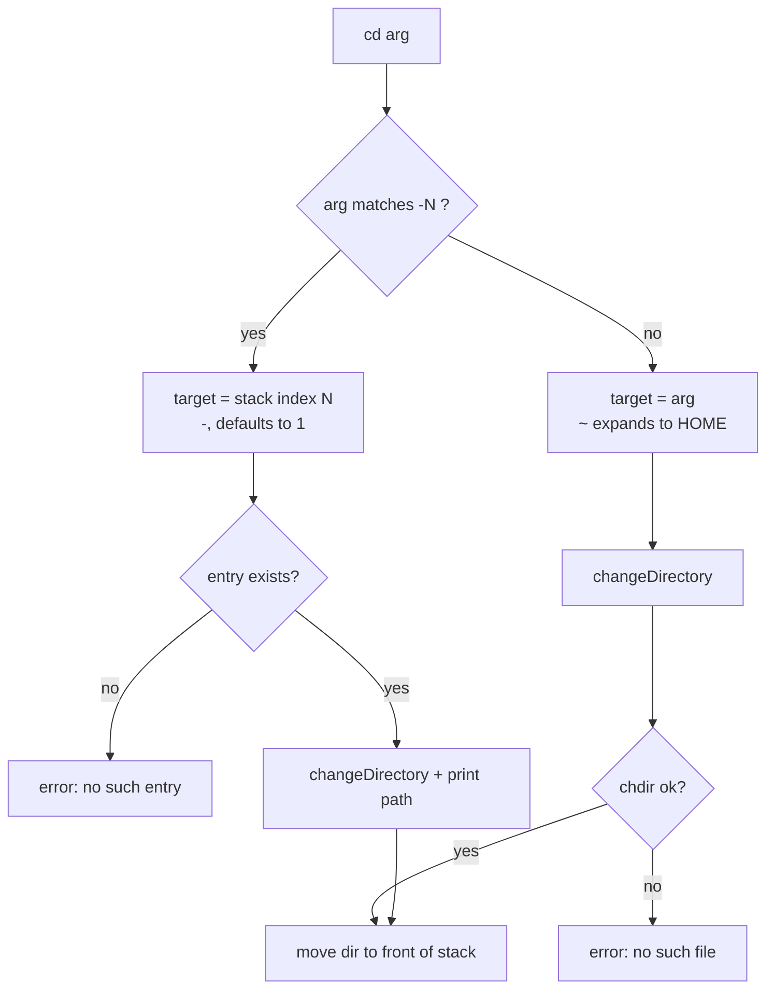

Because a visited directory is moved to the front (deduplicated), repeated
`cd -` toggles between the two most recent directories, exactly like zsh.

---

## 8. History and background jobs

**History** lives in memory and optionally syncs to `HISTFILE`.

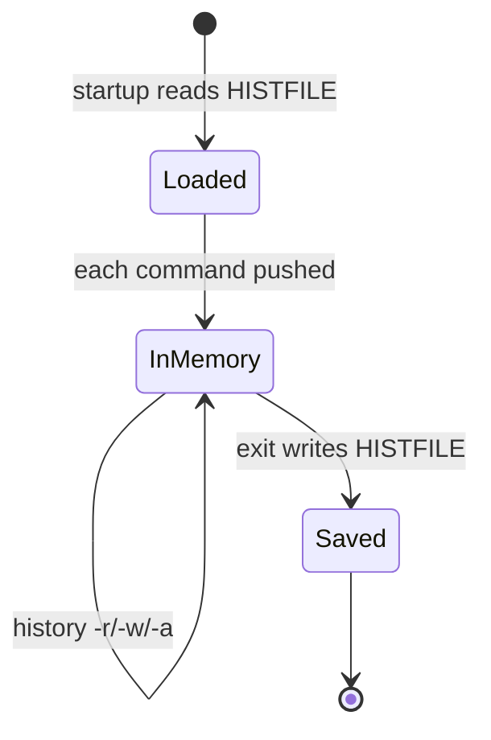

`lastHistoryAppendIndex` tracks how much of the in-memory history has already
been flushed, so `history -a` appends only the new entries.

**Jobs** track background children (`cmd &`).

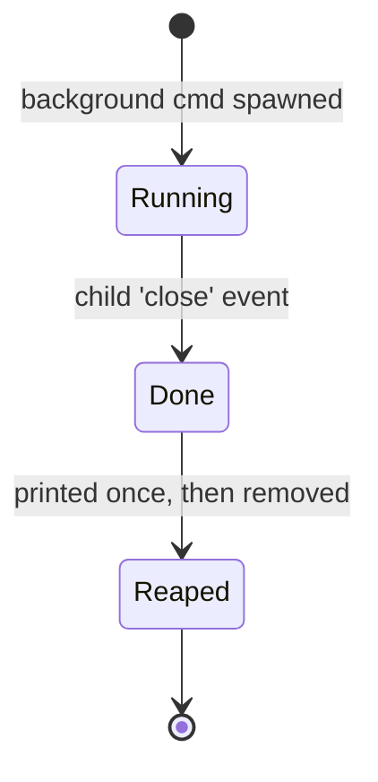

Finished jobs are reported and reaped lazily before each prompt
(`reapDoneJobs`). `exit` with a still-`Running` job prints
`There are running jobs.` once and requires a second `exit` to force quit.

---

## Reading order for newcomers

1. `main.js` → `shell.js` (`createShell`, `handleLine`) — the control flow.
2. `parser.js` — how a string becomes tokens, redirections and pipelines.
3. `executor.js` — PATH lookup and the two pipeline strategies.
4. `builtins.js` — the builtin command table and `cd` stack.
5. `completion.js`, `history.js`, `jobs.js`, `variables.js`, `colors.js` — the
   supporting subsystems, readable in any order.
